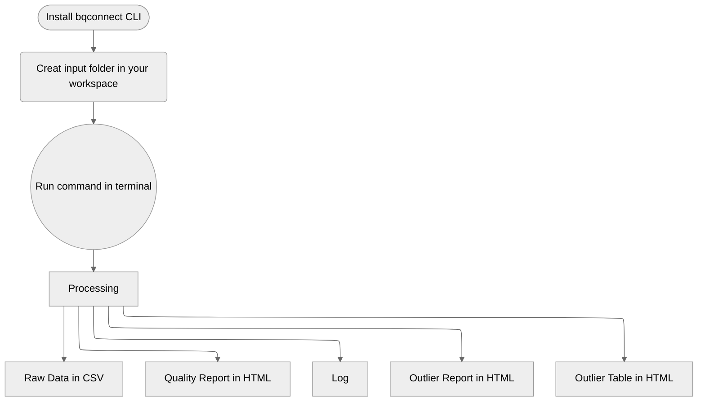

<details open markdown="block">
  <summary>
    Table of contents
  </summary>
  {: .text-delta }
- TOC
{:toc}
</details>

---

## Workflow




---

## Install

``` sh
pip install openbq
```

## Use Cases

### Validate Installation or Benchmarking

To validate your setup or benchmark your machine: 

``` sh
openbq --benchmark # you can specify modality (face, iris, finger) just like regular run too.
```

``` sh
openbq -B -M fingerprint # benchmark fingerprint analysis.
```

``` sh
openbq -B -M face -E ofiq # benchmark face analysis with OFIQ engine.
```

### Analyze Iris Images

If all the iris images are organised under the ‘data/input’ folder, the tool can be run in iris mode with the following command: 

``` sh
openbq --input data/input/ --mode iris
```

### Match Filename Pattern

Should the fingerprint files follow a naming convention containing the text ‘finger’, such as finger_1.jpg or X_finger.png, they can be located and analysed using: 

``` sh
openbq --input data/input/ --mode iris --filename "*FINGER*"
```

### Match Specific File Formats

If the input folder contains files in various formats and you want to focus on specific formats, the files can be identified and processed with this command: 

``` sh
openbq --input data/input/ --mode iris --type "jp2,bmp"
```

### Pre-processing before Analyzing

Before initiating the fingerprint scanning process, the file format may need to be converted. Use the following command to convert files of `JP2` and `JPEG` to `PNG` (the default target format):

``` sh
openbq --input data/input/ --mode fingerprint --convert "jp2,jpeg"
```
If there is specific requirement for the file format, the following command can be used to specify the target format, for example, `WSQ`:

> All the pre-processing processes are temporary only for the following analysis task, it will not modify the input file, and won’t be kept after the analysis. 

``` sh
openbq --input data/input/ --mode fingerprint --target wsq
```

### Find Outliers using Filter

When a filter is applied, there is going to be 2 extra outputs, a quality report on the outliers filtered and a page for you to view these samples. 

Get output of finderprint samples with `NFIQ2` score larger than 60:

``` sh
openbq --input data/input/ --mode finger --query "NFIQ2>60"
```

Provide output CSV from previous run and apply filter: 

``` sh
openbq --mode filter --input data/output.csv --query "NFIQ2<40"
```

Selected columns and apply filter query to them:

``` sh
openbq --mode filter --input data/output.csv --columns "NFIQ2,edge_std" --query "NFIQ2<40"
```

> Note: If there is any space along the filepath, wrap it with double quotes and escape the space.<br> Please refer to the example below: 

e.g. input folder is `data/iris folder/`

```sh
openbq --input "data/iris\ folder/" --mode iris
```

<a name="alt-engine">
### Select Alternative Face Analysis [Engines](https://docs.openbq.io/modalities/face.html#alt-engine-output)

Currently, open**bq** support 3 analysis engines for face modality:

+ OBQE (native Biometix)
+ OFIQ (by BSI)
+ BIQT (by MITRE)

``` sh
openbq --mode face --input data/input/ --engine ofiq
```

### Fusion Engine Mode

Specify `fusion` as the engine will give you combined output from both BQAT and OFIQ:

``` sh
openbq --mode face --input data/input/ --engine fusion
```

You may combine more than one engine using code below:

| Engine | Code |
| --- | --- |
| [OBQE](https://docs.openbq.io/modalities/face.html#obqe) | 4 (100) |
| [OFIQ](https://docs.openbq.io/modalities/face.html#ofiq) | 2 (010) |
| [BIQT](https://docs.openbq.io/modalities/face.html#biqt) | 1 (001) |

openbq and BIQT:

``` sh
openbq --mode face --input data/input/ --engine fusion --fusion 5
```

All 3 engines:

``` sh
openbq --mode face --input data/input/ --engine fusion --fusion 7
```

### Preprocessing Mode

You can feed a dataset to openbq and preprocess the images for later analysis.

The following example shows how you can send the folder `data/input/` in, and:
+ Convert the images to PNG format
+ Convert color mode to RGB
+ Resize the images by percentage (30% in this case)

``` sh
openbq -M preprocess -I data/input/ --config png,0.3,rgb
```

And of course you could configured it to do single preprocess at a time.

``` sh
# convert images to BMP
openbq -M preprocess -I data/input/ --config bmp

# convert images to grayscale
openbq -M preprocess -I data/input/ --config grayscale

# resize images by width (300px in this case, height will be inferred accordingly, aspect ratio maintained)
openbq -M preprocess -I data/input/ --config 300
```

> In terms of resizing configuration, number smaller than 10 will be treated as percentage/magnification, for instance, 3.7 will be 370%, while 128, which is greater than 10, will be 128 in width.

### Miscellaneous

Enable reporting to get a EDA report and preview page along with the raw CSV output:

``` sh
openbq --input data/input/ --mode iris --report
```

Process samples in /input, but limit to first 100k files:

``` sh
openbq --input data/input/ --mode face --limit 100000
```

Generate EDA report directly from existing CSV:

``` sh
openbq --input data/results.csv --mode report
```

For offline deployment on Linux server, download the pre-built static binary, and grant execute permission:

``` sh
chmod +x openbq
```

[Download](https://github.com/Open-Source-Biometric-Quality-Framework/bqConnect-CLI/releases){: .btn }

And replace the base command `openbq` with `./openbq`:

``` sh
./openbq --version
```

## bqconnect CLI Task Flags

Short | Long            | Description
----- | --------------- | -----------
`-M`  | `--mode`        | (REQUIRED)  Specify openbq running mode (fingerprint, face, iris, speech, filter, report, preprocessing).
`-I`  | `--input`       | (REQUIRED)  Specify input directory or CSV file for analysis.
`-O`  | `--output`      | (OPTIONAL)  Specify output directory.
`-R`  | `--report`      | (OPTIONAL)  Switch on/off EDA report generation (true, false).
`-E`  | `--engine`      | (OPTIONAL)  Select alternative face analysis engine (openbq, ofiq, biqt, fusion).
NA    | `--fusion`      | (OPTIONAL)  Fusion mode engine code.
`-B`  | `--benchmark`   | (OPTIONAL)  Run system benchmarking analysis.
`-L`  | `--limit`       | (OPTIONAL)  Set a limit for number of files to process.
`-F`  | `--filename`    | (OPTIONAL)  Specify filename pattern for searching in the folder.
NA    | `--type`        | (OPTIONAL)  Specify file types to process in the input folder.
`-C`  | `--convert`     | (OPTIONAL)  Specify file types to convert before processing.
`-T`  | `--target`      | (OPTIONAL)  Specify target type to convert to.
NA    | `--columns`     | (OPTIONAL)  Select columns to investigate
`-Q`  | `--query`       | (OPTIONAL)  Queries to apply on the columns
`-W`  | `--cwd`         | (OPTIONAL)  Specify current working directory for url in the report
NA    | `--config`      | (OPTIONAL)  Configure preprocessing task ([target format],[target width],[color mode (grayscale, rgb)]").

## Python Entry Point Flags

Short | Long            | Description
----- | --------------- | -----------
`-v`  | `--version`     | Display version info.
NA    | `--help`        | Display openbq task help info.
NA    | `--update`      | Check for new version backend container.
NA    | `--uninstall`   | Remove openbq.
NA    | `--tag`         | Specify backend container tag.
NA    | `--shm`         | Specify shared memory allocated to the container.

Check verions:

``` sh
openbq --version
```

Update bqconnect CLI (pull the latest container):

``` sh
openbq --update
```

Uninstall bqconnect CLI (CLI tool and/or backend container):

```sh
openbq --uninstall
```

Configure shared memory allocated to docker container (will allocate half of the physical memory avaiable by default):

```sh
openbq --shm 8192MB [openbq TASK OPTIONS]
```

Specify alternative backend container:

```sh
openbq --tag ghcr.io/open-source-biometric-quality-framework/bqcore-service:v1.0.0 [openbq TASK OPTIONS]
```

## Output Example

### Terminal Window


### Quality Report

#### Result Overview


#### Statistics of column `quality`


#### Cross Analysis 


### Filter for Outliers


### Tabulation of Outliers

You can click on it to view the origin file (need to be open in the working directory):


## Log

The log file will keep a record of information during the analysis process, including errors, warnings, and other metadata of the task. 

``` json
{
  "metadata": {
        "version": "openbq v0.0.1 beta",
        "datetime": "2026-00-00 00:59:59.984337",
        "input directory": "data/finger/",
        "processed": 208,
        "failed": 0,
        "log": 17,
        "process time": "0h0m28s"
    },
  "log": [
    {
      "nfiq2": "Error: NFIQ2 computeQualityScore returned an error code: Could not create feature set from raw data: FRFXLL_ERR_FB_TOO_SMALL_AREA: Fingerprint area is too small. Most likely this is because the tip of the finger is presented.",
      "file": "data/finger/00001052_plain_500_10.png"
    },
    {
      "convert": "jp2 -> png",
      "file": "data/finger/solid_0_801x1000.jp2"
    },
    {
      "nfiq2": "Error: NFIQ2 computeQualityScore returned an error code: Width is too large after trimming whitespace. WxH: 801x1000, but maximum width is 800",
      "file": "data/finger/solid_0_801x1000.jp2"
    },
    {
      "convert": "jp2 -> png",
      "file": "data/finger/solid_0_800x1001.jp2"
    },
    {
      "nfiq2": "Error: NFIQ2 computeQualityScore returned an error code: Height is too large after trimming whitespace. WxH: 800x1001, but maximum height is 1000",
      "file": "data/finger/solid_0_800x1001.jp2"
    },
  ]
}
```
---

## Output
{: .no_toc }

The outputs will be saved at: `data/output/`.

> Note: The tool is designed to be executed with a `/data` folder in your working directory. The `/data` folder (where all the images are stored) will be mounted to the container. "Read and write” permission is required for this folder. It should work as long as the folder was created before spinning up the server. Otherwise, the ownership of the folder will need to be changed.
