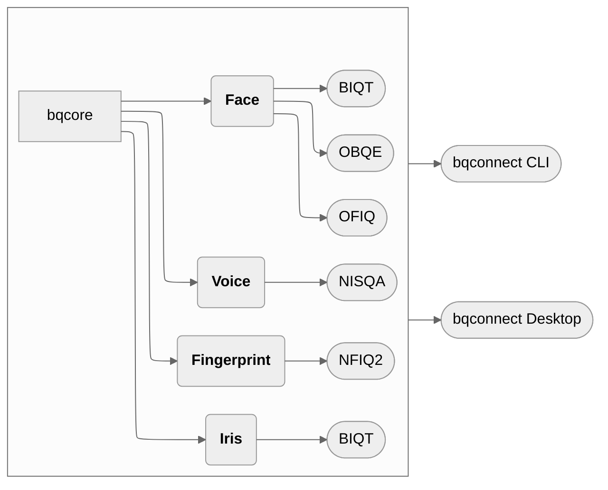

_Latest News_

> 🚀 First version of "open**bq**"!

---

_Releases_

{: .highlight }
>  open**bq** [v0.1.0](https://pypi.org/project/openbq/) released!🎉

---

by [Biometix](https://www.biometix.com/)

## Overview

[open**bq**](https://github.com/Open-Source-Biometric-Quality-Framework) (Open Source Biometric Quality Framework) is an open source biometric quality assessment tool for generating and analyzing biometric samples’ quality against international standards as well as customized metrics. openbq functions by taking an input directory of biometric data and producing raw quality information and an analysis report.

The quality of biometric samples is a key aspect of the performance and efficacy of a biometric system. Whilst there are a variety of tools suitable for each modality, this project is aimed to provide an open source framework to support all common modalities and allow for expansion as new methods are developed. 

---

---

## Modalities

+ [__Fingerprint__](http://docs.openbq.io/modalities/fingerprint.html)

    The engine for the analysis of fingerprints is based on NIST/NFIQ2 quality features. The quality score links the image quality of optical and ink 500 PPI fingerprints to operational recognition performance. 

+ [__Face__](http://docs.openbq.io/modalities/face.html)

    The face image assessment module provides metrics including head pose, smile detection, inter-eye distance, closed eyes, etc. 

+ [__Iris__](http://docs.openbq.io/modalities/iris.html)

    The iris sample assessment module provides various quality attributes, features, and ISO metrics.

+ [__Voice__](http://docs.openbq.io/modalities/voice.html)

    The voice assessment module provides various quality metrics, including naturalness, colouration, noisiness, etc. 

### Key features of the project

+ Biometrics quality assessment platform for different modalities and processing engines
+ A variety of different methods of access, including via CLI, web page and/or web API 
+ Simple installation via Docker 
+ Quality report
+ Built by an experienced biometric consulting team
+ An active open-source community

### Supporting libraries

+ [NFIQ2](https://github.com/usnistgov/NFIQ2)
+ [OFIQ](https://www.bsi.bund.de/EN/Themen/Unternehmen-und-Organisationen/Informationen-und-Empfehlungen/Freie-Software/OFIQ/OFIQ_node.html)
+ [BIQT](https://github.com/mitre/biqt)
+ [MediaPipe](https://github.com/google/mediapipe)
+ [NISQA](https://github.com/gabrielmittag/NISQA)

## The Toolbox

+ __[CLI](https://github.com/Open-Source-Biometric-Quality-Framework/bqConnect-CLI)__

    
    
    
    
    
    
    
    
    
    

    open**bq** in the terminal. A CLI tool for easy biometric quality assessment.

<!-- + __[Desktop](https://github.com/Open-Source-Biometric-Quality-Framework/bqConnect-Desktop)__

    
    
    
    
    

    An easy to use desktop application to work with the openbq services. -->

## Roadmap

Coming soon 🚀

---

{: .highlight }
> Please [contact us](http://docs.openbq.io/about/#about-us) if you'd like more information.
